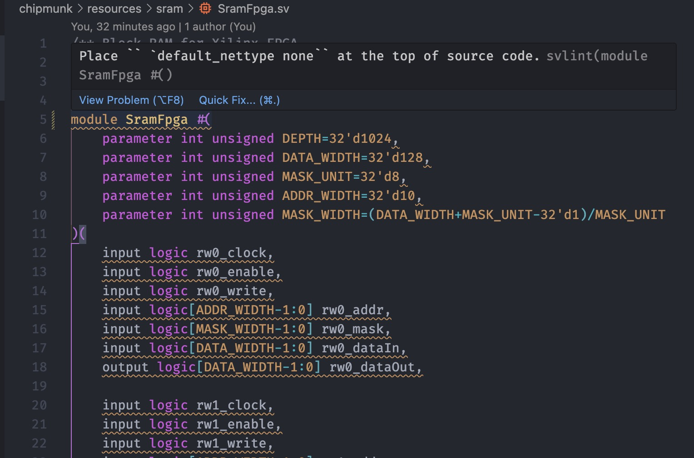

<h1 align=center> SystemVerilog Linter in VSCode </h1>
<div align="center">

**Lint your SystemVerilog on the fly!**

</div>



## Installation & Setup

### Requirements

- [svlint](https://github.com/dalance/svlint), an open-sourced linter for SystemVerilog, must be installed in your `PATH` environment variable.
- Custom your linting rule file `.svlint.toml`, and put it to the repository root or set a environment variable `SVLINT_CONFIG`.

### Configurations

By default, the linter `svlint` is invoked as follows:
```shell
svlint -1 $file
```
where `$file` is the RTL file currently opened in the editor.

You can edit `linter.linters.svlint.command` in your VSCode setting file `settings.json`:
```json
"linter.linters": {
    "svlint": {
        "command": [
            "svlint",
            "-1",
            "$file"
        ],
        // ...
    }
}
```

## Inspiration & Contribution

If you find any bugs or have any ideas, please feel free to [open an issue](https://github.com/zhutmost/vscode-svlint/issues).

This extension is powered by [@dalance/svlint](https://github.com/dalance/svlint), [@fnando/vscode-linter](https://github.com/fnando/vscode-linter) and many other open-source projects.
Thanks for their excellent jobs.
